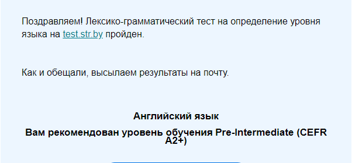

# Anton Tsokur

## Contacts:

- **E-mail:** flamer723@gmail.com
- **Discord:** flamer(@ATsokur)
- **GitHub:** [ATsokur](https://github.com/ATsokur)

## About me:

My path to learning programming started with HTML. For today I know HTML, basics of CSS and little bit JavaScript. Learning to program is hard for me, but it's very interesting. I want to become a Front-end developer.

## Example of code:

```

function sum(a, b) {
  return a + b;
}

console.log(sum(10, 7));
```


## Skills:

- **HTML**
- **CSS**(basics)
- **JS**(basics)
- **GIT**

## Languages:

- **Russian**(Native)
- **English**(A2)


